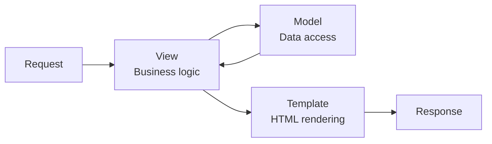

# Django Framework Documentation

Welcome to the Django section of the knowledge base. This guide is designed to take you from a basic understanding of web requests to building complex, database-driven applications using the most popular "batteries-included" Python web framework.

## What is Django?

Django is a high-level Python web framework that encourages rapid development and clean, pragmatic design. It was built by experienced developers to handle much of the hassle of web development, so you can focus on writing your app without needing to reinvent the wheel.

## The "Batteries-Included" Philosophy

Django follows a "batteries-included" philosophy. This means that common tasks needed for web development are provided out-of-the-box, including:

- **Authentication**: A full user authentication system.
- **Admin Interface**: An automatically generated site for managing your data.
- **Object-Relational Mapper (ORM)**: A way to interact with your database
  using Python instead of SQL.
- **Security**: Protection against common attacks like SQL injection,
  cross-site scripting (XSS), and cross-site request forgery (CSRF).

## The MVT Pattern (Model-View-Template)

While many frameworks use the MVC (Model-View-Controller) pattern, Django uses a slight variation called MVT.

- **Model**: The data structure. This is where you define your database tables
  as Python classes.
- **View**: The logic. This layer processes the user's request, interacts with
  the Model, and determines what data to send back. (In MVC, this is the
  Controller).
- **Template**: The presentation. This is the HTML layer that determines how
  the data is rendered for the user. (In MVC, this is the View).

## How This Section is Structured

We will explore Django incrementally, starting with how a request travels
through the system and ending with professional deployment.

- **Part 1: Core Architecture**: Setting up projects, apps, and the URL
  dispatcher.
- **Part 2: The Data Layer**: Mastering the ORM, migrations, and
  relationships.
- **Part 3: User Interaction**: Building forms and handling authentication.
- **Part 4: APIs and Beyond**: Transitioning to Django REST Framework (DRF)
  for modern decoupled applications.

## Learning Path

Follow these pages in order for a smooth progression:

1. [Introduction to Web Frameworks](django/Introduction%20to%20Web%20Frameworks.md)
2. [Routing](django/Routing.md)
3. [Views & Logic](django/Views%20%26%20Logic.md)
4. [Templates & Frontend Integration](django/Templates%20%26%20Frontend%20Integration.md)
5. [Models & Databases](django/Models%20%26%20Databases.md)
6. [Forms](django/Forms.md)
7. [Authentication & Security](django/Authentication%20%26%20Security.md)
8. [Django REST Framework](django/Django%20REST%20Framework.md)
9. [Intermediate Features](django/Intermediate%20Features.md)
10. [Deployment & Best Practices](django/Deployment%20%26%20Best%20Practices.md)
