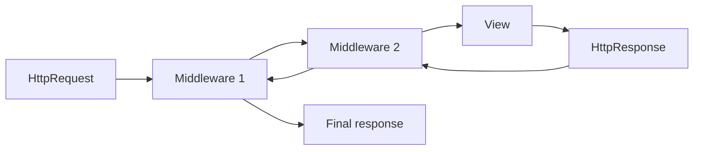

# 9. Intermediate Features

This chapter covers the "connective tissue" of Django. These tools let you hook into the framework's internal processes to automate tasks, enforce policies, and keep your codebase clean as your project grows.

## Middleware

Middleware is a framework of hooks into Django's request/response processing. Think of it as a pipeline of small components that can:

* **Inspect requests globally**: For example, attach a request ID or block suspicious requests.
* **Modify responses globally**: For example, add security headers or compress responses.

### How it works

Every request passes through a "stack" of middleware on its way to the view, and the response passes back through them in reverse order.



### Creating custom middleware

Custom middleware is useful when a concern should apply to many (or all) views, such as request timing, header policies, or audit logging.

```python
# middleware.py
import logging
import time

from django.utils.deprecation import MiddlewareMixin

logger = logging.getLogger(__name__)


class RequestTimingMiddleware(MiddlewareMixin):
    def __init__(self, get_response):
        self.get_response = get_response

    def __call__(self, request):
        start_time = time.time()
        response = self.get_response(request)
        duration = time.time() - start_time

        if duration > 1.0:
            logger.warning(
                f"Slow request: {request.path} took {duration:.2f}s"
            )

        response['X-Response-Time'] = f"{duration:.3f}s"
        return response


class SecurityHeadersMiddleware(MiddlewareMixin):
    def __init__(self, get_response):
        self.get_response = get_response

    def __call__(self, request):
        response = self.get_response(request)

        response['X-Content-Type-Options'] = 'nosniff'
        response['X-Frame-Options'] = 'DENY'
        response['X-XSS-Protection'] = '1; mode=block'
        return response
```

### Configuring middleware

Middleware is enabled in `settings.py` via the `MIDDLEWARE` list. Order matters because request processing is top-to-bottom and response processing is bottom-to-top.

```python
# settings.py
MIDDLEWARE = [
    'django.middleware.security.SecurityMiddleware',
    'django.contrib.sessions.middleware.SessionMiddleware',
    'django.middleware.common.CommonMiddleware',
    'django.middleware.csrf.CsrfViewMiddleware',
    'django.contrib.auth.middleware.AuthenticationMiddleware',
    'django.contrib.messages.middleware.MessageMiddleware',
    'django.middleware.clickjacking.XFrameOptionsMiddleware',
    'myapp.middleware.RequestTimingMiddleware',
    'myapp.middleware.SecurityHeadersMiddleware',
]
```

## Mini Walkthrough: Add a Request ID to Every Response

This walkthrough shows a realistic middleware use case: attach a request ID so you can correlate logs and client error reports.



\`\`\`python import uuid

from django.utils.deprecation import MiddlewareMixin

class RequestIdMiddleware(MiddlewareMixin): def **init**(self, get\_response): self.get\_response = get\_response

```
def __call__(self, request):
    request_id = uuid.uuid4().hex
    request.request_id = request_id

    response = self.get_response(request)
    response['X-Request-Id'] = request_id
    return response
```

`</div><div data-gb-custom-block data-tag="tab" data-title='settings.py'>`python MIDDLEWARE = \[ # ... Django middleware 'myapp.middleware.RequestIdMiddleware', ] `</div><div data-gb-custom-block data-tag="tab" data-title='views.py (optional)'>`python from django.http import HttpResponse

def debug\_view(request): return HttpResponse(f"Request ID: {request.request\_id}")

````</div></div>

### Conditional middleware behavior

Sometimes you only want to apply logic in specific situations (for example: only for HTML responses, or only for a certain URL prefix). This is usually done inside a middleware's `__call__` method.

If your goal is **response compression**, prefer Django’s built-in gzip middleware. Simply setting `Content-Encoding: gzip` is not enough; you must actually compress the response body.

```python
# settings.py
MIDDLEWARE = [
    # ...
    'django.middleware.gzip.GZipMiddleware',
    # ...
]
````

### Signals

Django includes a "signal dispatcher" that helps decoupled applications get notified when actions occur elsewhere in the framework. This is a clean way to implement: "When X happens, do Y" without hard-coding calls between modules.

#### Common built-in signals

* **`post_save`**: Runs after a model instance is saved. Often used to create related records (like user profiles).
* **`pre_delete`**: Runs before a model instance is deleted. Often used for cleanup work.
* **`user_logged_in`**: Runs after a user successfully logs in. Often used for audit logging.

#### Example: creating a Profile automatically

This pattern keeps your user creation logic simple while still guaranteeing a related `Profile` exists.

```python
# signals.py
from django.contrib.auth.models import User
from django.db.models.signals import post_save
from django.dispatch import receiver

from .models import Profile


@receiver(post_save, sender=User)
def create_user_profile(sender, instance, created, **kwargs):
    if created:
        Profile.objects.create(user=instance)
```

#### Custom signals

Custom signals are useful for domain events such as "order placed" or "invoice paid".

```python
# signals.py
from django.dispatch import Signal, receiver


order_placed = Signal()


@receiver(order_placed)
def send_order_confirmation(sender, order_id, **kwargs):
    send_confirmation_email(order_id)
```

```python
# Somewhere in your domain logic
order_placed.send(sender=Order, order_id=order.id)
```

#### Signal best practices

* **Keep receivers small and predictable**: Receivers should be short, side-effect aware, and safe to run more than once. If a receiver can run twice, it should not create duplicate records or send duplicate emails.
* **Avoid hidden heavy work**: Signals run inside the request/transaction flow unless you explicitly offload work. Expensive operations (email sending, API calls, image processing) should typically go to a background task queue.
* **Be careful with circular imports**: Signals are often imported for their side effects (receiver registration). Wiring them up in `apps.py` helps avoid circular imports and ensures receivers register once when the app is ready.

#### Disconnecting signals

Disconnecting can help in tests or migrations where you temporarily want to disable side effects.

```python
post_save.disconnect(create_user_profile, sender=User)
post_save.disconnect(sender=User)
```

### The Django Admin

One of Django's most powerful features is the automatic Admin Interface. It reads your models and provides a production-ready interface for non-technical users to manage site content.

#### Customizing the admin

You can customize how models appear by creating a class that inherits from `admin.ModelAdmin` in `admin.py`.

```python
# admin.py
from django.contrib import admin

from .models import Post


@admin.register(Post)
class PostAdmin(admin.ModelAdmin):
    list_display = ('title', 'author', 'published_date', 'is_draft')
    list_filter = ('is_draft', 'published_date')
    search_fields = ('title', 'content')
    prepopulated_fields = {'slug': ('title',)}
```

### The Django Shell

Sometimes you need to interact with your data or quickly test a QuerySet without writing a view. The Django Shell loads your project settings and models into an interactive Python environment.

```bash
python manage.py shell
```

Inside the shell, you can run commands like `Post.objects.count()` or experiment with filters and annotations.

### Summary

* **Middleware** is for cross-cutting concerns that should apply to many requests.
* **Signals** are for decoupled "events" inside Django (useful, but easy to overuse).
* **Admin** gives you a powerful back-office interface with minimal code.
* **Shell** is the fastest way to debug ORM logic and inspect data.

### Important Keywords

#### **Middleware**

Reusable component that can inspect or modify requests/responses globally.

#### **Middleware Stack**

The ordered chain of middleware that handles the request and then the response.

#### **Signal**

An event-like mechanism in Django that allows sending notifications without direct coupling.

#### **Receiver**

A function that "listens" for a signal and runs when the signal is sent.

#### **sender**

The object or class that emits a signal, used for filtering which events a receiver should handle.

#### **post\_save**

A built-in Django signal fired after a model instance is saved.

#### **pre\_delete**

A built-in Django signal fired before a model instance is deleted.

#### **Admin Site**

Django's built-in web UI for managing model data.

#### **ModelAdmin**

A configuration class that controls how a model is displayed and edited in the admin.

#### **Django Shell**

Interactive Python shell that loads Django settings so you can work with models and QuerySets.


