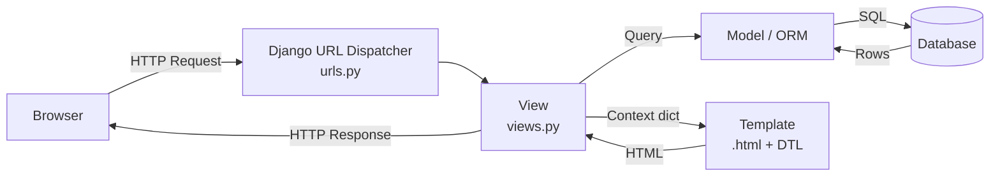

# 1. Introduction to Web Frameworks

Django is often called a batteries-included framework because it provides almost everything a developer needs to build a web application out of the box. To understand how to use it, we must first understand how it handles a single click from a user.

## The Request-Response Cycle

When a user enters a URL in their browser, a complex but structured cycle begins. Django acts as the middleman between the user's request and the server's database.

1. **Request**: The browser sends an HttpRequest object to the server.
2. **URL Dispatcher**: Django looks at the URL and searches `urls.py` to
   find a match.
3. **View**: Once a match is found, the specific "View" function/class is
   executed. The View handles the logic (e.g., "Get the latest 10 posts").
4. **Model/Database**: If needed, the View talks to the Model to fetch or
   save data.
5. **Template**: The View passes data to a Template to render a pretty HTML
   page.
6. **Response**: Django sends an HttpResponse back to the browser, and the
   user sees the website.



## MVT Architecture

As mentioned in the introduction, Django follows the Model-View-Template pattern. This separation of concerns makes your code easier to maintain and scale.

- **Model (`models.py`)**: The Data. It defines the "shape" of your data.
  Django uses these classes to automatically create your database
  tables.
- **View (`views.py`)**: The Logic. It decides what data gets displayed. It
  fetches data from the Model and hands it to the Template.
- **Template (`.html`)**: The Layout. It defines how the data looks. It uses
  the Django Template Language (DTL) to inject dynamic data into HTML.

## Project vs. App: The "Pluggable" Philosophy

One of the most confusing concepts for beginners is the difference between a Project and an App.

- **The Project**: The entire website/web application. It contains the global
  configurations (database settings, time zones, and installed apps).
- **The App**: A self-contained module that does one specific thing.
  - Example: A project called `MySocialMedia` might have three apps:
    `users`, `posts`, and `chat`.

Why this way? This makes apps "pluggable." You could theoretically take your
chat app and drop it into a completely different Django project with very
little modification.

## Initial Setup

### 1. Creating the Project

Once Django is installed in your virtual environment, you use the
`django-admin` tool to generate the base structure.

```bash
django-admin startproject my_website .
```

(The `.` at the end tells Django to create the project in the current folder, avoiding an extra sub-directory.)

### 2. The Core Files

- `manage.py`: Your Swiss Army Knife. You use it to run the server, create
  apps, and handle migrations.
- `settings.py`: The "Brain" of the project. This is where you register apps
  and configure your database.
- `urls.py`: The "Map" of your website.

### 3. Creating an App

After creating the project, you create your first app using `manage.py`.

```bash
python manage.py startapp blog
```

### 4. Running the Server

Django comes with a built-in development server. It should not be used for
production, but it's perfect for building.

```bash
python manage.py runserver
```

## Mini Walkthrough: Your First Page (URL → View → Template)

This walkthrough connects the abstract request-response cycle to real files you create.





```python
from django.shortcuts import render

def home(request):
    return render(request, 'blog/home.html', {'message': 'Hello from Django!'})
```





```python
from django.urls import path
from . import views

app_name = 'blog'

urlpatterns = [
    path('', views.home, name='home'),
]
```





```python
from django.contrib import admin
from django.urls import include, path

urlpatterns = [
    path('admin/', admin.site.urls),
    path('', include('blog.urls')),
]
```





```html
<!-- blog/templates/blog/home.html -->
<h1>{{ message }}</h1>
```





Now when you visit `/`, Django:

- **Matches the URL** in `urls.py`
- **Runs the view** in `views.py`
- **Renders the template** with the context

## Core Concepts in Practice

### Middleware: Request/Response Processing Pipeline

Before a request reaches your view, it passes through a stack of **middleware**.
Middleware processes requests globally and can modify or reject them.

```python
# settings.py
MIDDLEWARE = [
    'django.middleware.security.SecurityMiddleware',
    'django.contrib.sessions.middleware.SessionMiddleware',
    'django.middleware.common.CommonMiddleware',
    'django.middleware.csrf.CsrfViewMiddleware',
    'django.contrib.auth.middleware.AuthenticationMiddleware',
    'django.contrib.messages.middleware.MessageMiddleware',
]
```

Each middleware component processes the request in order, then the response
in reverse order. This enables features like:

- **Session management** (stores user data across requests)
- **CSRF protection** (prevents cross-site request forgery attacks)
- **Authentication** (identifies the user)
- **Security headers** (adds security-related HTTP headers)

### Context: Passing Data to Templates

Views pass a **context** dictionary to templates. This context contains all the
variables the template can use.

```python
# views.py
from django.shortcuts import render

def home(request):
    context = {
        'username': 'Alice',
        'posts': ['Post 1', 'Post 2', 'Post 3'],
        'post_count': 3
    }
    return render(request, 'home.html', context)
```

```html
<!-- templates/home.html -->
<h1>Welcome, {{ username }}!</h1>
<p>You have {{ post_count }} posts:</p>
<ul>

    <li>{{ post }}</li>

</ul>
```

### Template Inheritance: Avoiding Repetition

Django templates support inheritance via `` and ``.
This creates a base layout that other templates can extend.

```html
<!-- templates/base.html -->
<!DOCTYPE html>
<html>
<head>
    <title>My Site</title>
</head>
<body>
    <header>
        <h1>My Website</h1>
    </header>
    <main>
        
    </main>
</body>
</html>
```

```html
<!-- templates/home.html -->


Home - My Site


    <h2>Welcome Home!</h2>
    <p>This is the home page content.</p>

```

### Static Files: CSS, JavaScript, and Images

Static files are served separately from dynamic content. Django collects them
during deployment.

```python
# settings.py
STATIC_URL = '/static/'
STATICFILES_DIRS = [BASE_DIR / 'static']
```

```html

<link rel="stylesheet" href="">
<script src=""></script>
```

### The Admin Site: Automatic Data Management

Django automatically generates an admin interface from your models. Register
your models to make them manageable.

```python
# blog/admin.py
from django.contrib import admin
from .models import Post

@admin.register(Post)
class PostAdmin(admin.ModelAdmin):
    list_display = ('title', 'author', 'created_date')
    list_filter = ('author', 'created_date')
    search_fields = ('title', 'content')
```

Visit `/admin/` to manage your data with a professional interface.

### Migrations: Evolving Your Database Schema

When you change your models, Django tracks these changes as **migrations**.

```bash
# Create migration file from model changes
python manage.py makemigrations

# Apply migrations to database
python manage.py migrate
```

Migrations ensure your database schema stays in sync with your models across
development, staging, and production.

### QuerySets: Lazy Database Operations

The ORM returns **QuerySets**, which are lazy—they don’t hit the database
until you evaluate them.

```python
# views.py
from .models import Post

def post_list(request):
    # QuerySet is unevaluated here
    all_posts = Post.objects.all()

    # QuerySet is evaluated when iterated, sliced, or converted
    recent_posts = all_posts.order_by('-created_date')[:5]

    # Filtering creates a new QuerySet
    published_posts = all_posts.filter(status='published')

    return render(request, 'blog/list.html', {'posts': recent_posts})
```

### CSRF Protection: Securing Forms

Django protects against Cross-Site Request Forgery (CSRF) attacks by requiring
a token in forms.

```html
<form method="post">
    
    <input type="text" name="username">
    <button type="submit">Submit</button>
</form>
```

The `` tag adds a hidden input with a security token that
Django validates on POST requests.

### Deployment: From Development to Production

For production, you’ll need:

- A production web server (e.g., Nginx)
- WSGI application server (e.g., Gunicorn)
- Database (PostgreSQL recommended)
- Static file serving
- Environment variables for sensitive settings

```python
# wsgi.py (generated by Django)
import os
from django.core.wsgi import get_wsgi_application

os.environ.setdefault('DJANGO_SETTINGS_MODULE', 'myproject.settings')
application = get_wsgi_application()
```

Run with Gunicorn:

```bash
gunicorn myproject.wsgi:application
```

## Summary

- The Request-Response Cycle is the path data takes from the user to the
  server and back.
- MVT separates data (Model), logic (View), and presentation (Template).
- Projects are the container; Apps are the functional modules inside.
- `manage.py` is the command-line tool used for almost all administrative
  tasks.

## Important Keywords

### **Request-Response Cycle**

The flow of data from the user’s browser to the server and back, including URL
dispatching, view logic, model interaction, templating, and response.

### **MVT (Model-View-Template)**

Django’s architectural pattern separating data (Model), logic (View), and
presentation (Template).

### **Project**

The entire Django application, containing global configuration and multiple
apps.

### **App**

A self-contained module within a Django project that handles a specific
functionality.

### **URL Dispatcher**

Django’s mechanism for mapping incoming URLs to the appropriate view function
or class using `urls.py`.

### **View**

Python function or class that receives a web request and returns a web
response; contains the business logic.

### **Model**

Python class that defines the structure of your data, mapped to a database
table by Django’s ORM.

### **Template**

HTML file with Django Template Language (DTL) tags and filters used to render
dynamic data.

### **ORM (Object-Relational Mapper)**

Django’s system for interacting with the database using Python objects instead
of raw SQL.

### **Django Template Language (DTL)**

Template syntax used in Django templates for variable substitution, loops,
conditions, and template inheritance.

### **`manage.py`**

Command-line utility for Django project administrative tasks (runserver,
migrate, startapp, etc.).

### **`django-admin`**

System-wide Django command-line tool for creating projects and performing
project-level tasks.

### **Settings (`settings.py`)**

Configuration file for a Django project, including database settings, installed
apps, and security settings.

### **URLconf (`urls.py`)**

File that defines URL patterns and maps them to views.

### **Development Server**

Built-in lightweight server (`runserver`) for development; not suitable for
production.

### **Pluggable Architecture**

Django’s design philosophy allowing apps to be reused across different
projects with minimal changes.

### **Migration**

Django’s way of propagating changes you make to your models into your
database schema.

### **Static Files**

CSS, JavaScript, images, and other assets that don’t change dynamically.

### **Middleware**

Hooks that modify Django’s request/response objects globally during processing.

### **Context**

Dictionary of variables passed from a view to a template for rendering.

### **Template Inheritance**

Mechanism allowing templates to extend base templates and override specific
blocks.

### **Admin Site**

Automatic interface for managing application data, generated from model
definitions.

### **QuerySet**

Collection of database objects retrieved from the database via the ORM,
supporting filtering, ordering, and aggregation.

### **CSRF (Cross-Site Request Forgery)**

Security feature in Django to prevent malicious websites from submitting forms
on behalf of users.

### **Session**

Mechanism for storing information about a specific user across multiple
requests.

### **Deployment**

Process of moving a Django application from development to a production
environment.

### **WSGI (Web Server Gateway Interface)**

Python standard for connecting web servers to web applications; Django uses
WSGI for production deployment.
