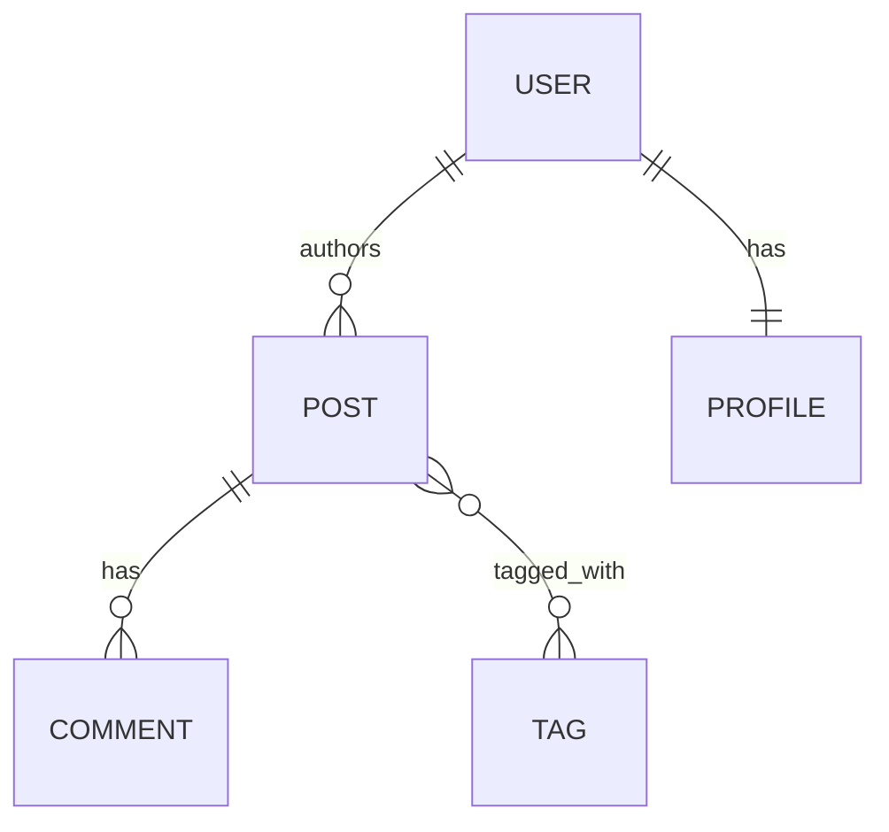

# 5. Models & Databases

Django's Model layer is the heart of the application. It uses an Object-Relational Mapper (ORM), which allows you to interact with your database using Python code instead of writing raw SQL queries.

## Defining Models

A Model is a Python class that represents a single table in your database. Each attribute of the class represents a database field.

```python
from django.db import models

class Post(models.Model):
    title = models.CharField(max_length=200)
    content = models.TextField()
    published_date = models.DateTimeField(auto_now_add=True)
    is_draft = models.BooleanField(default=True)

    def __str__(self):
        return self.title
```

* **models.Model**: Every model must inherit from this class.
* **`__str__()`**: A magic method that defines how the object is displayed in the Django Admin and the Python shell.

## Common Field Types

Django provides dozens of field types that handle validation and SQL column types automatically.

| Field Type    | Description                                        | SQL Equivalent |
| ------------- | -------------------------------------------------- | -------------- |
| CharField     | For small-to-medium strings. Requires max\_length. | VARCHAR        |
| TextField     | For large amounts of text.                         | TEXT           |
| IntegerField  | For whole numbers.                                 | INTEGER        |
| DateTimeField | For date and time.                                 | DATETIME       |
| ForeignKey    | Creates a many-to-one relationship.                | REFERENCES     |
| ImageField    | For file uploads (requires the Pillow library).    | VARCHAR (path) |

### Field Options

Every field accepts common arguments:

```python
class Article(models.Model):
    title = models.CharField(
        max_length=200,
        unique=True,          # No duplicates
        help_text="Enter title"
    )
    content = models.TextField(
        blank=True,           # Optional in forms
        null=True            # Can be NULL in database
    )
    created_at = models.DateTimeField(
        auto_now_add=True    # Set on creation only
    )
    updated_at = models.DateTimeField(
        auto_now=True        # Update on every save
    )
```

## Migrations: The Bridge to SQL

Since you're writing Python classes, you need a way to tell the database to update its schema. This is handled by Migrations.

```bash
# Django looks at your models.py and creates a "plan" (a migration file)
python manage.py makemigrations

# Django executes that plan and updates the actual database tables
python manage.py migrate
```

**Note**: You must run these commands every time you add, remove, or change a field in your models.

## Mini Walkthrough: Add a Model, Migrate, and Query It

This walkthrough connects the full model workflow: define a model, create tables via migrations, and query the data back.



\`\`\`python

## blog/models.py

from django.db import models

class Post(models.Model): title = models.CharField(max\_length=200) slug = models.SlugField(unique=True) content = models.TextField() published\_date = models.DateTimeField(null=True, blank=True)

```
def __str__(self):
    return self.title
```

`</div><div data-gb-custom-block data-tag="tab" data-title='migrations'>`bash python manage.py makemigrations python manage.py migrate `</div><div data-gb-custom-block data-tag="tab" data-title='shell'>`bash python manage.py shell

````

```python
from blog.models import Post

Post.objects.create(title='Hello Django', slug='hello-django', content='First post!')

post = Post.objects.get(slug='hello-django')
post.title
```</div></div>

## QuerySets (The ORM)

A QuerySet is a collection of objects from your database. You use them to filter, order, and retrieve data.

### 1. Basic Retrieval

```python
# Get all posts
all_posts = Post.objects.all()

# Get a single post by ID (raises error if not found)
post = Post.objects.get(id=1)

# Filter posts (returns a QuerySet, can be empty)
drafts = Post.objects.filter(is_draft=True)
````

#### 2. Field Lookups (The "Double Underscore")

Django uses a double underscore `__` to perform advanced filtering.

```python
# Case-insensitive "contains"
Post.objects.filter(title__icontains="django")

# Greater than
Post.objects.filter(id__gt=5)

# Starts with
Post.objects.filter(title__startswith="How to")

# In a list
Post.objects.filter(status__in=['draft', 'published'])

# Date lookups
Post.objects.filter(published_date__year=2023)
Post.objects.filter(published_date__month=12)
```

#### 3. QuerySet Chaining

QuerySets are lazy—you can chain them together:

```python
# Chain multiple filters
published_posts = Post.objects.filter(
    is_draft=False
).filter(
    published_date__year=2023
).order_by('-published_date')

# Same as above with __and__
Post.objects.filter(
    is_draft=False,
    published_date__year=2023
)
```

#### 4. Complex Queries with Q Objects

Use Q objects for OR queries and complex conditions:

```python
from django.db.models import Q

# OR query
Post.objects.filter(
    Q(title__icontains="django") | 
    Q(content__icontains="django")
)

# Complex combination
Post.objects.filter(
    Q(title__icontains="django") & 
    ~Q(is_draft=True)  # NOT draft
)
```

### Model Relationships

Real-world data is interconnected. Django handles these connections via relational fields.



#### 1. Many-to-One (ForeignKey)

Example: A blog has many Posts, but each Post belongs to one Author.

```python
class Post(models.Model):
    author = models.ForeignKey(
        'User', 
        on_delete=models.CASCADE,
        related_name='posts'  # Allows: user.posts.all()
    )

# Usage
post = Post.objects.first()
author = post.author  # Get the author

# Reverse relationship
user = User.objects.first()
user_posts = user.posts.all()  # Get all posts by this user
```

**on\_delete options**:

* **CASCADE**: Delete related objects
* **PROTECT**: Prevent deletion of referenced object
* **SET\_NULL**: Set foreign key to NULL (requires null=True)
* **SET\_DEFAULT**: Set to default value

#### 2. Many-to-Many

Example: A Post can have many Tags, and a Tag can belong to many Posts.

```python
class Post(models.Model):
    tags = models.ManyToManyField('Tag', related_name='posts')

class Tag(models.Model):
    name = models.CharField(max_length=50)

# Usage
post = Post.objects.first()
post_tags = post.tags.all()  # Get all tags for this post

# Add relationship
tag = Tag.objects.get(name='python')
post.tags.add(tag)

# Remove relationship
post.tags.remove(tag)

# Filter by relationship
Post.objects.filter(tags__name='python')
```

#### 3. One-to-One

Example: A User has exactly one Profile.

```python
class Profile(models.Model):
    user = models.OneToOneField(
        'User', 
        on_delete=models.CASCADE,
        primary_key=True
    )
    bio = models.TextField()

# Usage
user = User.objects.first()
try:
    profile = user.profile
except Profile.DoesNotExist:
    profile = Profile.objects.create(user=user, bio="New user")
```

### Optional: Advanced ORM Features

#### Aggregation and Annotation

```python
from django.db.models import Avg, Count
authors_with_counts = User.objects.annotate(
    post_count=Count('posts')
)

# Average value
avg_rating = Post.objects.aggregate(
    avg_rating=Avg('rating')
)

# Filter on annotated values
popular_authors = User.objects.annotate(
    post_count=Count('posts')
).filter(post_count__gt=10)
```

#### Raw SQL (When Needed)

Sometimes you need raw SQL for complex queries:

```python
# Safe raw SQL with parameters
from django.db import connection

def get_posts_by_year(year):
    with connection.cursor() as cursor:
        cursor.execute(
            "SELECT * FROM blog_post WHERE EXTRACT(YEAR FROM published_date) = %s",
            [year]
        )
        return cursor.fetchall()

# Or use raw() method for model instances
posts = Post.objects.raw(
    "SELECT * FROM blog_post WHERE published_date > %s",
    ['2023-01-01']
)
```

#### Database Transactions

Ensure data integrity with transactions:

```python
from django.db import transaction

@transaction.atomic
def transfer_funds(from_account, to_account, amount):
    # Both operations succeed or fail together
    from_account.balance -= amount
    from_account.save()

    to_account.balance += amount
    to_account.save()

    # If an exception occurs, both changes are rolled back
```

### Model Methods and Properties

Add custom behavior to your models:

```python
from django.db import models
from django.utils import timezone

class Post(models.Model):
    title = models.CharField(max_length=200)
    content = models.TextField()
    published_date = models.DateTimeField()
    is_draft = models.BooleanField(default=True)

    def __str__(self):
        return self.title

    # Custom method
    def publish(self):
        self.is_draft = False
        self.published_date = timezone.now()
        self.save()

    # Property (computed field)
    @property
    def word_count(self):
        return len(self.content.split())

    # Class method
    @classmethod
    def get_published(cls):
        return cls.objects.filter(is_draft=False)

    # Custom manager
    objects = PostManager()

class PostManager(models.Manager):
    def published(self):
        return self.get_queryset().filter(is_draft=False)
```

### Best Practices

1. **Use descriptive field names** that clearly indicate their purpose. Field names become part of your API for other developers and your future self. If a field is ambiguous, the code around it becomes harder to read.
2. **Add `help_text` for better admin usability**. Admin users benefit from hints and constraints, and `help_text` doubles as lightweight documentation for your data model.
3. **Use appropriate field types** (CharField vs TextField). Use `CharField` for bounded strings you’ll index or search by; use `TextField` for long bodies of text that won’t fit typical limits.
4. **Always set `on_delete`** for relationship fields. This defines what should happen when related data is removed, and prevents accidental orphan records or unexpected cascades.
5. **Use `related_name` intentionally**. It makes reverse relationships readable (`user.posts.all()`), and avoids name collisions when you have multiple relations to the same model.
6. **Consider indexes for frequently queried fields**. If you frequently filter by `slug`, `created_at`, or foreign keys, indexes can dramatically speed up queries in production.
7. **Use transactions for multi-step operations**. When multiple writes must succeed together (payments, inventory transfers), `transaction.atomic()` keeps your data consistent.
8. **Prefer the ORM over raw SQL** unless absolutely necessary. The ORM is safer and portable. Raw SQL is harder to maintain and often database-specific, so treat it as an escape hatch.

### Summary

* Models define your database structure as Python classes
* Migrations keep your database schema in sync with your models
* QuerySets provide a powerful, Pythonic way to query data
* Relationships (ForeignKey, ManyToMany, OneToOne) connect related data
* The ORM handles SQL generation, protecting you from injection attacks

### Important Keywords

#### **ORM (Object-Relational Mapper)**

Django's system for interacting with the database using Python objects instead of raw SQL.

#### **Model**

Python class that defines the structure of your data, mapped to a database table by Django's ORM.

#### **Field**

Attribute of a Model class that represents a database column with specific type and validation rules.

#### **Migration**

Django's way of propagating changes you make to your models into your database schema.

#### **QuerySet**

Collection of database objects retrieved from the database via the ORM, supporting filtering, ordering, and aggregation.

#### **Field Lookup**

Double-underscore syntax (`field__lookup`) for performing advanced database queries and filtering.

#### **ForeignKey**

Field that creates a many-to-one relationship between two models, establishing a database foreign key constraint.

#### **ManyToManyField**

Field that creates a many-to-many relationship between models, using an intermediate join table.

#### **OneToOneField**

Field that creates a one-to-one relationship between models, ensuring unique association.

#### **on\_delete**

Parameter that defines behavior when the referenced object is deleted (CASCADE, PROTECT, SET\_NULL, etc.).

#### **related\_name**

Custom name for the reverse relationship from the related model back to the current model.

#### **Annotation**

Adding computed fields to QuerySets using aggregate functions like Count, Sum, Avg.

#### **Aggregation**

Performing calculations across a QuerySet to return a single value (count, sum, average).

#### **Q Object**

Object used to create complex queries with OR conditions and negation.

#### **Transaction**

Database operation that ensures multiple changes either all succeed or all fail together.

#### **Manager**

Interface through which database query operations are performed on Model objects.

#### **Raw SQL**

Direct SQL queries executed when the ORM cannot express complex operations efficiently.

#### **Property**

Computed attribute on a model that doesn't exist in the database but is calculated on access.

#### **Class Method**

Method bound to the class rather than an instance, commonly used for alternative query methods.


