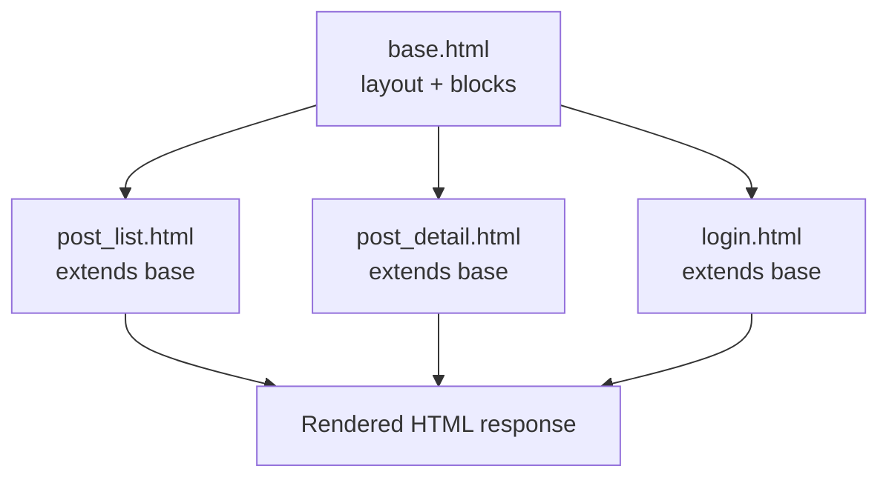

# 4. Templates & Frontend Integration

While Views handle the logic, Templates handle the presentation. Django uses the Django Template Language (DTL), which allows you to bridge the gap between static HTML and dynamic Python data.

## The Django Template Language (DTL)

DTL is designed to be readable and secure. It uses three main types of syntax:

### 1. Variables `{{ }}`

Used to output data from the context dictionary passed by the view.

```html
<h1>{{ post.title }}</h1>
<p>Written by: {{ post.author.username }}</p>
<p>Published: {{ post.published_date|date:"M d, Y" }}</p>
```

### 2. Tags ``Used for logic, such as loops, conditionals, and loading external resources.

````html

    
        <article>
            <h2>{{ post.title }}</h2>
            <p>{{ post.content|truncatewords:20 }}</p>
            <small>By {{ post.author.username }}</small>
        </article>
    

    <p>No posts found.</p>

```### 3. Filters `|`

Used to transform the way a variable is displayed.

```html
{{ post.content|truncatewords:20 }}
{{ post.published_date|date:"M d, Y" }}
{{ post.title|upper }}
{{ post.content|safe }}  <!-- Renders HTML without escaping -->
{{ user.email|default:"No email provided" }}
````

## Template Inheritance

Django encourages the **DRY (Don't Repeat Yourself)** principle through template inheritance. Instead of copying the header and footer into every file, you create a "base" layout.



### The Parent: `base.html`

This file contains the skeleton of your site. You define "blocks" that child templates can fill in.



\`\`\`html\{% block title %\}My Site\{% endblock %\} \{% load static %\} \{% block extra\_css %\}\{% endblock %\}Home Blog \{% if user.is\_authenticated %\} \{{ user.username \}} Logout \{% else %\} Login \{% endif %\}

```
<main class="content">
    
        <div class="messages">
            
                <div class="message {{ message.tags }}">
                    {{ message }}
                </div>
            
        </div>
    

    
    
</main>

<footer>
    <p>&copy; 2023 My Site. All rights reserved.</p>
</footer>


```

\`\`\`



\`\`\`html \{% extends 'base.html' %\}

\{% block title %\}Blog Posts - My Site\{% endblock %\}

\{% block content %\}

## All Posts

```
    
        <article class="post">
            <h2>
                <a href="">
                    {{ post.title }}
                </a>
            </h2>
            <p class="meta">
                By {{ post.author.username }} on 
                {{ post.published_date|date:"F j, Y" }}
            </p>
            <div class="excerpt">
                {{ post.content|truncatewords:30 }}
            </div>
            <a href="" class="read-more">
                Read More
            </a>
        </article>
    
        <p>No posts found.</p>
    
</div>


    <div class="pagination">
        
            <a href="?page=1">&laquo; First</a>
            <a href="?page={{ page_obj.previous_page_number }}">Previous</a>
        

        <span>Page {{ page_obj.number }} of {{ page_obj.paginator.num_pages }}</span>

        
            <a href="?page={{ page_obj.next_page_number }}">Next</a>
            <a href="?page={{ page_obj.paginator.num_pages }}">Last &raquo;</a>
        
    </div>

```

\{% endblock %\}

````</div></div>##

This walkthrough shows how templates connect to views and how inheritance keeps your UI consistent.<div data-gb-custom-block data-tag="tabs"><div data-gb-custom-block data-tag="tab" data-title='views.py'>```python
# blog/views.py
from django.shortcuts import render
from .models import Post

def post_list(request):
    posts = Post.objects.all().order_by('-published_date')
    return render(request, 'blog/post_list.html', {'posts': posts})
```</div><div data-gb-custom-block data-tag="tab" data-title='template'>```html
<!-- blog/templates/blog/post_list.html -->


Blog


  <h1>Posts</h1>

  
    <article>
      <h2>
        <a href="">{{ post.title }}</a>
      </h2>
      <p>{{ post.content|truncatewords:30 }}</p>
    </article>
  
    <p>No posts yet.</p>
  

```</div></div>### 3. Result

Because the template extends `base.html`, every page shares the same navigation/footer, while each page only defines its own ``.

## Optional: Advanced Template Features

### Context Processors

Context processors add variables to every template context:

```python
# context_processors.py
from .models import Category

def categories_context(request):
    return {'categories': Category.objects.all()}

# settings.py
TEMPLATES = [
    {
        'BACKEND': 'django.template.backends.django.DjangoTemplates',
        'OPTIONS': {
            'context_processors': [
                'django.template.context_processors.debug',
                'django.template.context_processors.request',
                'django.contrib.auth.context_processors.auth',
                'django.contrib.messages.context_processors.messages',
                'myapp.context_processors.categories_context',
            ],
        },
    },
]
````

**Template Tags and Filters**

Create custom template tags for reusable logic:

```python
# templatetags/blog_tags.py
from django import template
from ..models import Post

register = template.Library()

@register.simple_tag
def total_posts():
    return Post.objects.count()

@register.inclusion_tag('blog/latest_posts.html')
def show_latest_posts(count=5):
    latest_posts = Post.objects.order_by('-published_date')[:count]
    return {'latest_posts': latest_posts}

@register.filter
def markdown(value):
    import markdown
    return markdown.markdown(value)
```

````html
<!-- Usage in templates -->


<p>Total posts: </p>



{{ post.content|markdown }}
```## Handling Static Files

Static files are assets that don't change, like CSS, JavaScript, and images. Django provides a specific way to manage these to ensure they work in both development and production.

### 1. Configuration (`settings.py`)

You must tell Django where your static files live.

```python
# Static files (CSS, JavaScript, Images)
STATIC_URL = '/static/'
STATICFILES_DIRS = [BASE_DIR / 'static']
STATIC_ROOT = BASE_DIR / 'staticfiles'  # For collectstatic

# Additional static file finders
STATICFILES_FINDERS = [
    'django.contrib.staticfiles.finders.FileSystemFinder',
    'django.contrib.staticfiles.finders.AppDirectoriesFinder',
]
````

#### 2. Usage in Templates

To use a static file, you must first "load" the static tag at the top of your template.

````html


<!DOCTYPE html>
<html>
<head>
    <link rel="stylesheet" href="">
    <link rel="stylesheet" href="">
</head>
<body>
    <header>
        
    </header>

    <script src=""></script>
    <script src=""></script>
</body>
</html>
```### 3. Static File Organization

```text
static/
├── css/
│   ├── style.css
│   ├── admin.css
│   └── responsive.css
├── js/
│   ├── main.js
│   ├── vendor/
│   │   ├── jquery.min.js
│   │   └── bootstrap.min.js
│   └── admin.js
├── images/
│   ├── logo.png
│   ├── favicon.ico
│   └── backgrounds/
└── fonts/
    ├── roboto.woff2
    └── icons.woff
````

### Media Files (User Uploads)

Unlike static files (which you provide), Media files are uploaded by users (like profile pictures).

#### Configuration

```python
# Media files (user uploads)
MEDIA_URL = '/media/'
MEDIA_ROOT = BASE_DIR / 'media'
```

#### URL Configuration

In development, you need to add a specific line to your `urls.py` to serve these files.

```python
# urls.py
from django.conf import settings
from django.conf.urls.static import static

urlpatterns = [
    # ... your URL patterns
]

# Serve media files in development
if settings.DEBUG:
    urlpatterns += static(settings.MEDIA_URL, document_root=settings.MEDIA_ROOT)
```

#### Template Usage

````html


<!-- User profile picture -->


<!-- Post attachments -->

    <a href="{{ attachment.file.url }}" download>
        {{ attachment.file.name }}
    </a>

```## Forms in Templates

Django forms render cleanly in templates with proper error handling.

### Basic Form Rendering

```html
<form method="post" enctype="multipart/form-data">
    

    {{ form.as_p }}

    <button type="submit">Submit</button>
</form>
```### Custom Form Rendering

```html
<form method="post">
    

    
        <div class="form-group">
            <label for="{{ field.id_for_label }}">{{ field.label }}</label>

            {{ field }}

            
                <small class="form-text text-muted">{{ field.help_text }}</small>
            

            
                <div class="invalid-feedback">
                    
                        <div>{{ error }}</div>
                    
                </div>
            
        </div>
    

    <button type="submit" class="btn btn-primary">Submit</button>
</form>
```### Formsets

```html

    <div class="formset-row">
        {{ form }}
    </div>


{{ formset.management_form }}
```## Template Context and Variables

### Accessing Context Data

```html
<!-- Direct variable access -->
{{ user.username }}
{{ request.path }}
{{ request.GET.search }}

<!-- Dictionary access -->
{{ post.author.username }}
{{ post.metadata.tags }}

<!-- List access -->
{{ posts.0.title }}
{{ tags|first }}

<!-- Method calls (no arguments) -->
{{ post.get_absolute_url }}
{{ user.get_full_name }}
````

#### Conditional Logic

````html

    <div class="admin-panel">
        <a href="">Admin Panel</a>
    </div>

    <div class="user-panel">
        Welcome, {{ user.username }}!
    </div>

    <div class="guest-panel">
        <a href="">Login</a>
    </div>

```### Loops and Iteration

```html

    <article>
        <h2>{{ post.title }}</h2>

        
            <span class="tag">{{ tag.name }}</span>
        
            <span class="no-tags">No tags</span>
        

        
            <em>First post!</em>
        

        
            <em>Last post!</em>
        

        <p>Post {{ forloop.counter }} of {{ forloop.parentloop.counter }}</p>
    </article>

```## Security in Templates

### Auto-escaping

Django automatically escapes HTML content to prevent XSS attacks:

```html
<!-- Safe: HTML is escaped -->
{{ user_input }}

<!-- Unsafe: Renders raw HTML (use only with trusted content) -->
{{ trusted_content|safe }}
````

#### CSRF Protection

Always include CSRF tokens in forms:

````html
<form method="post">
    
    <!-- form fields -->
</form>
```## Optional: Internationalization (i18n)

### Translation Tags

```html


<!-- Simple translation -->


<!-- Translation with context -->


<!-- Pluralization -->

There is {{ counter }} comment.

There are {{ counter }} comments.


<!-- Translation with variables -->

By {{ author }}

```## Optional: Performance Optimization

### Template Caching

```python
# settings.py
TEMPLATES = [
    {
        'BACKEND': 'django.template.backends.django.DjangoTemplates',
        'OPTIONS': {
            'loaders': [
                ('django.template.loaders.cached.Loader', [
                    'django.template.loaders.filesystem.Loader',
                    'django.template.loaders.app_directories.Loader',
                ]),
            ],
        },
    },
]
````

#### Efficient Template Design

````html
<!-- Avoid expensive operations in templates -->

    


<!-- Use with template tags for complex queries -->


    {{ post.title }}

```## Best Practices

1. **Keep templates simple**.
   Templates should focus on rendering, not heavy logic. If you find yourself needing complex conditionals or data processing, move that logic into the view or a custom template tag.
2. **Use inheritance to avoid duplication**.
   Put shared layout into `base.html` and override blocks. This reduces maintenance costs and keeps UI consistent as your project grows.
3. **Organize static files predictably**.
   A clear `static/` structure (css/js/images) prevents naming collisions and makes `collectstatic` + CDN caching easier later.
4. **Always use CSRF tokens in forms**.
   Any POST form should include ``. Without it, Django will reject requests (and you’d be vulnerable if you disabled CSRF protection).
5. **Don’t bypass escaping unless you trust the content**.
   Django auto-escapes variables to prevent XSS. Filters like `safe` should only be used for trusted, sanitized HTML.
6. **Use meaningful block names**.
   Blocks like `content`, `title`, and `extra_js` make templates easy to reason about and prevent accidentally overriding the wrong area.
7. **Cache expensive rendering when needed**.
   Caching is an optimization tool, not a default. Use it once you identify bottlenecks, and cache fragments that don’t change per-user.
8. **Separate concerns**.
   Views prepare the data and decide what to render; templates display it. Keeping that boundary clear makes debugging and testing easier.

## Summary

- DTL uses `{{ }}` for data, `` for logic, and `|` for formatting
- Inheritance (`extends` and `block`) allows you to manage a consistent layout across the whole site from one file
- `` is required to link CSS, JS, and images
- Separation of Concerns: Keep your HTML in templates and your logic in views
- Security features protect against XSS and CSRF attacks
- Template tags and filters extend DTL functionality

## Important Keywords

### **Django Template Language (DTL)**

Django's templating system that provides a safe way to generate dynamic HTML from static templates and dynamic data.

### **Variable**

Template syntax `{{ variable }}` used to output data from the context dictionary passed by the view.

### **Tag**

Template syntax `` used for logic operations like loops, conditionals, and template control structures.

### **Filter**

Template syntax `{{ variable|filter }}` used to transform variable output for display formatting.

### **Template Inheritance**

Mechanism allowing templates to extend base templates and override specific blocks, promoting code reuse.

### **Block**

Named section in a base template that child templates can override with custom content.

### **Static Files**

CSS, JavaScript, images, and other assets that don't change dynamically, served separately from Django.

### **Media Files**

User-uploaded files like profile pictures and document attachments, stored separately from static files.

### **Context Processor**

Function that adds variables to the context of every template automatically.

### **Template Tag**

Custom function that can be called in templates to perform complex operations or generate HTML.

### **Template Filter**

Custom function that transforms variable values for display in templates.

### **CSRF Token**

Security feature that prevents cross-site request forgery attacks by validating form submissions.

### **Auto-escaping**

Django's automatic HTML escaping of template variables to prevent XSS attacks.

### **Internationalization (i18n)**

Process of making templates translatable into multiple languages using translation tags.

### **Template Caching**

Performance optimization that caches compiled templates to avoid repeated parsing.

### **Context Dictionary**

Data passed from views to templates, containing variables accessible in the template.

### **URL Reversing**

Generating URLs from their names instead of hardcoding them, using `` tag.

### **Messages Framework**

System for displaying temporary messages to users (success, error, info messages).

### **Form Rendering**

Process of displaying Django forms in templates with proper field rendering and error display.
````


